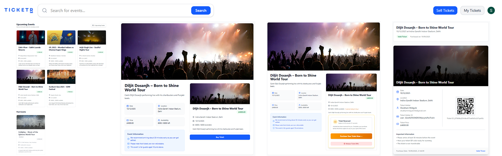

# 🎟 Ticketr — Ticketing Marketplace SaaS

**Ticketr** is a full-stack **Ticketing Marketplace SaaS** built from scratch with **Next.js 15**.  
It features a **real-time ticket purchase queue**, **rate limiting**, a powerful **seller dashboard**, **secure payments with Stripe Connect**, and **Clerk authentication**.  
The UI is designed with **shadcn/ui** and **Tailwind CSS**, and the entire project is written in **TypeScript**.

---

## 🚀 Features

- **Real-Time Queue System**  
  Smart queue with live position updates during ticket booking.

- **Rate Limiting**  
  Prevents abuse by limiting the number of people in the purchase queue.

- **Seller Dashboard**  
  Manage events, tickets, refunds, and more.

- **Complete Event CRUD**  
  Create, update, delete events, with automatic ticket refunds if canceled.

- **Secure Payments with Stripe Connect**  
  Handles ticket sales, payouts, platform fees, and refunds.

- **Clerk Authentication + MFA**  
  Secure login with email/password, social auth, and Multi-Factor Authentication.

- **Beautiful UI/UX**  
  Built using **shadcn/ui** components and **Tailwind CSS**.

- **TypeScript Everywhere**  
  Reduces bugs and improves maintainability.

- **Deployment Ready**  
  Optimized for deployment on **Vercel**.

---

## 🧱 Tech Stack

- **Framework**: [Next.js 15](https://nextjs.org/)
- **Language**: [TypeScript](https://www.typescriptlang.org/)
- **Styling**: [Tailwind CSS](https://tailwindcss.com/) + [shadcn/ui](https://ui.shadcn.com/)
- **Auth**: [Clerk](https://clerk.com/)
- **Payments**: [Stripe Connect](https://stripe.com/connect)
- **Database**: [Convex](https://www.convex.dev/)
- **Deployment**: [Vercel](https://vercel.com/)

---
